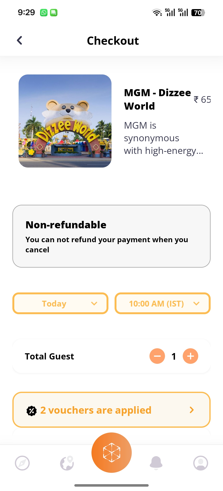

# safARee

**safARee** is a React Native–based ecosystem provider designed for amusement parks. Acting as a SaaS platform, it empowers amusement parks to better serve their visitors by enabling seamless booking, food ordering, navigation, and other interactive features—all within one unified application.

This project was built as freelance work during my college days and handed over to a now-dissolved company. The complete frontend development (59 distinct screens) was accomplished in **12 consecutive days**.

---

## ✨ Features

* **Park Service Integration**: Amusement parks can integrate safARee to offer rides, restaurants, and tickets directly to visitors.
* **Ride & Restaurant Booking**: Customers can book rides and tables at restaurants with ease.
* **Food Ordering & Payment**: Visitors can order and pay for food directly through the app.
* **Interactive Navigation**: Includes 2D maps with Google Maps API + Mapbox API, plus AR View support.
* **Real-time Weather**: Integrated with Open Meteo API for live park weather updates.
* **Social Features**: Review rides, restaurants, and connect via social links.
* **Admin Tools**: Manage ride/dish visibility, update ticket prices, and more.

---

## 📱 Screens Overview

Below are the key pages and flows included in the project.
(Screenshots to be inserted — each full-screen capture at **1256 x 2760 px** resolution).

Here are three sample screens (click to open full-size):

| Welcome | Landing | Home |
| --- | --- | --- |
|  |  |  |

### Authentication & Onboarding

* Splash Page
* Onboarding (3 pages)
* Welcome Page (Login/Register links)
* Login Page
* Registration Page
* Forgot Password (with OTP verification)

### Discovery & Exploration

* Landing Page

  * Top Destinations
  * Where to Go
  * Offers Section
* Search Functionality
* Filter Page
* Recent Searches
* Sort by Distance, Ratings, Price Range

### Details & Bookings

* Ride Details Page
* Restaurant Details Page
* Amusement Park Details Page

  * Overview & Reviews Section
  * Image Carousels & Expanded Views
* Ticket Booking Page
* Food Ordering Page
* Checkout Page (Restaurants)

### User Profile & Settings

* User Profile Page
* Edit Profile Page
* Edit Profile OTP Verification
* Social Link Page
* Notification Page
* Notification Edit Page
* Review Page

### Admin Tools

* Admin Page

  * Toggle Ride/Dish Visibility
  * Update Ticket Price

### Utility Pages

* Weather Page (Open Meteo API)
* Maps Page

  * 2D Navigation with Google Maps + Mapbox
  * AR View & AR Navigation Support

### Engagement & Monetization

* New Comer Page
* Go Pro Page

---

## 🛠️ Tech Stack

* **Frontend**: React Native
* **Maps & Navigation**: Google Maps API, Mapbox API
* **Weather**: Open Meteo Weather API
* **AR Support**: AR View + AR Navigation (UI prepared)

---

## 📸 Screenshots

| Screen 1 | Screen 2 | Screen 3 | Screen 4 |
| --- | --- | --- | --- |
|  |  |  |  |
|  |  |  |  |
|  |  |  |  |
|  |  |  |  |
|  |  |  |  |
|  |  |  |  |
|  |  |  |  |

---

## 🚀 Development Timeline

* **Duration**: 12 consecutive days
* **Screens Completed**: 59 distinct screens
* **Role**: Sole frontend developer

---

## 📂 Project Status

This project was developed as a freelance engagement and handed over to a client company (now dissolved).
The current repository represents the **frontend implementation** as built during that engagement.

---

## 📄 License

This project is not actively maintained and is shared here for portfolio/reference purposes.
For licensing details, please contact the original developer.
